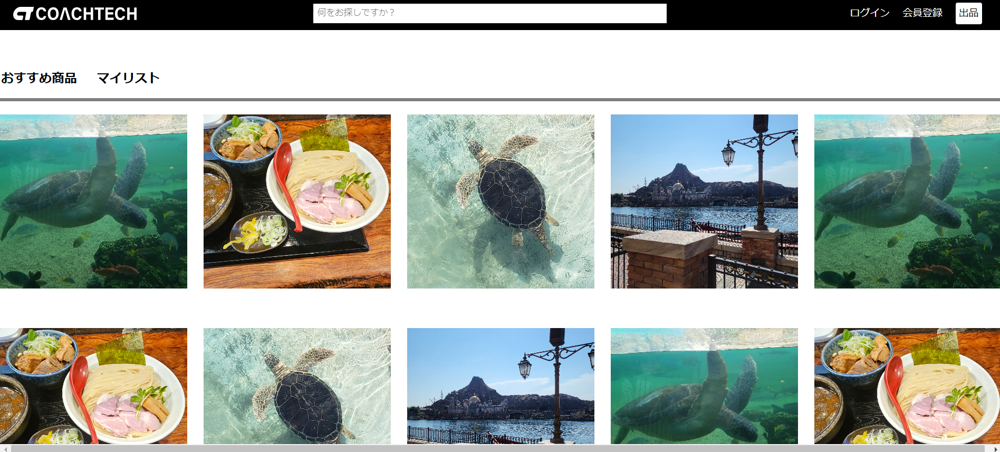
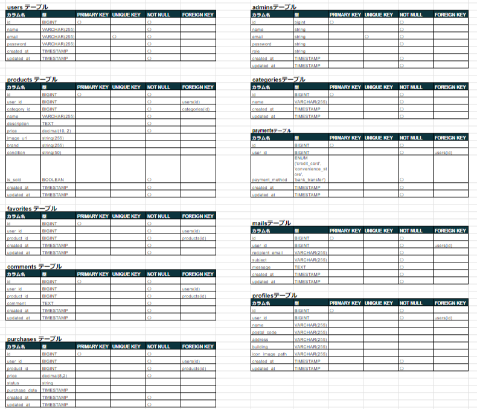
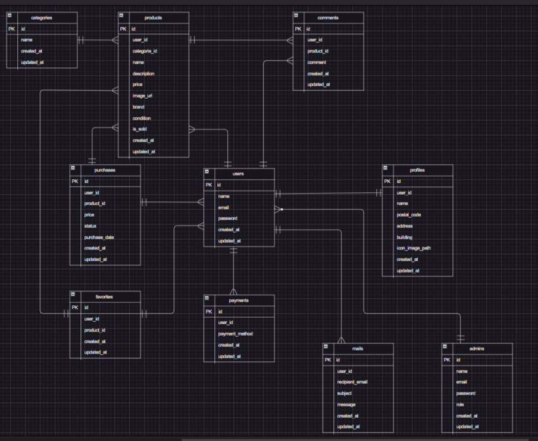

<p align="center"><a href="https://laravel.com" target="_blank"></a></p>

<p align="center">
<a href="https://travis-ci.org/laravel/framework"></a>
<a href="https://packagist.org/packages/laravel/framework"></a>
<a href="https://packagist.org/packages/laravel/framework"></a>
<a href="https://packagist.org/packages/laravel/framework"></a>
</p>

# フリマアプリケーション
## プロダクト概要
 フリマアプリを学習として開発しました。
 ログイン前は商品検索、ログイン後は購入機能や商品の出品機能、商品にコメントができます。

 

## 作成した目的
 実務案件を想定して学習として作成しました。

## URL
 一般利用画面
http://

 管理者画面
http://

## 機能一覧
ログイン機能、ユーザー登録機能、商品一覧の表示　商品検索機能

【ログイン時の機能】
出品機能、プロフィール情報変更機能
商品へのコメント追加、削除機能
お気に入り追加、削除機能
購入機能　stripe決済機能、支払い方法変更、配送先変更機能

## 仕様技術
docker、Laravel 8.X、PHP7.3、laravel-fortify、stripe15.8

## テーブル設計


## ER図


## 環境構築
###コマンドライン上
```
$ git clone https://github.com/simanuki0923/market-System.git
```

```
$ docker compose up -d --build
$ docker compose exec php bash
```

### PHPコンテナ内
```
$ composer install
$ cp .env.local .env
```

### market-System上　【Windowsエラー表示になった場合】
```
$ sudo chmod -R 777 src/* 
```

### PHPコンテナ内
```
$ php artisan key:generate
$ php artisan migrate
$ php artisan db:seed
$ php artisan storage:link
```

### market-System/src
```
$ sudo chmod -R 775 storage
$ sudo chmod -R 775 bootstrap/cache
```

### PHPコンテナ内
### CSS修正出来ない場合設定
```
$ npm install
$ npm run watch
```
